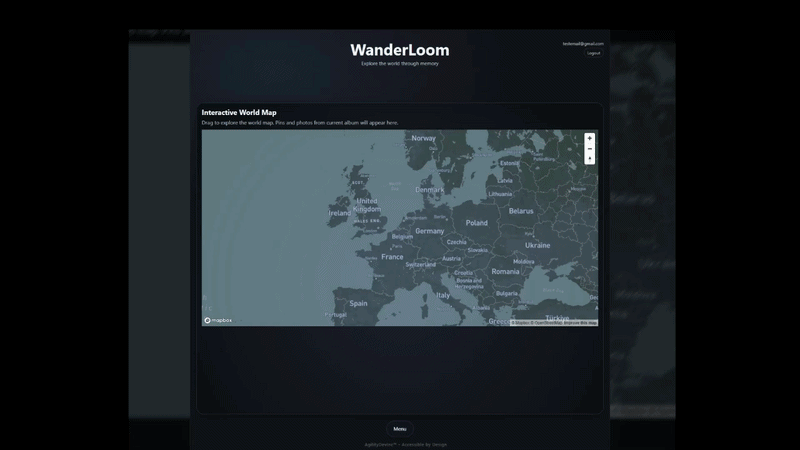

<a id="readme-top"></a>
<!-- 
README styling provided by https://github.com/othneildrew/Best-README-Template
 https://readme.so/
 https://www.markdownguide.org/basic-syntax/
 -->


<details>
  <summary>Table of Contents</summary>
  <ol>
    <li><a href="#about-wanderloom">About The Project</a></li>
    <li><a href="#demo">Demo</a></li>
    <li><a href="#built-with">Built With</a></li>
    <li><a href="#local-setup">Local Setup</a></li>
    <li><a href="#api-reference">API References</a></li>
    <li><a href="#features">Features</a></li>
    <li><a href="#limitations">Limitations</a></li>
    <li><a href="#project-coordination">Project Coordination</a></li>
    <li><a href="#creators">Creators</a></li>
  </ol>
</details>

# About WanderLoom 🌏

Wanderloom is a travel journal application that allows users to upload photos, extract GPS metadata, and revisit travel locations through an interactive map interface. Photos are displayed as location-based markers, enabling users to explore memories in a visual and immersive way. The application supports organizing photos into albums and sharing travel journals with others.

## Demo


[Check it out here!](https://nom-db.netlify.app/)

## Built With


## Local Setup

Clone the project (or download zip of the project)

```bash
  git clone https://github.com/yevgeniymazur/AgilityDevInc.git
```

Go to the project directory

```bash
  cd AgilityDevInc
```

Install dependencies

```bash
  npm install
```

Start the server

```bash
  npm run dev
```
## API Reference
### Firebase Documentation
https://firebase.google.com/docs

### MapBox GL JS Documentation
https://docs.mapbox.com/mapbox-gl-js/guides/

### Mapbox Styles API
https://docs.mapbox.com/api/maps/styles/

## Features

- Account creation and authentication
- Users can create photo albums and store photos into them
- GPS data is extracted from photo metadata, pinning photos onto an interactive map

### Future Features
- Manual location editing
- Album creation and management
- Photo organization within albums
- Sharing travel journals

## Limitations

* Only accepts JPEG/JPG format at this time. 
* Cannot edit location data.
* Lacks security features for photo upload.

## Creators 👋

- [@yevgeniymazur](https://github.com/yevgeniymazur)
- [@2shayd](https://github.com/2shayd)
- [@nthaberl](https://www.github.com/nthaberl)

## Project Coordination


<p align="right">(<a href="#readme-top">back to top</a>)</p>
